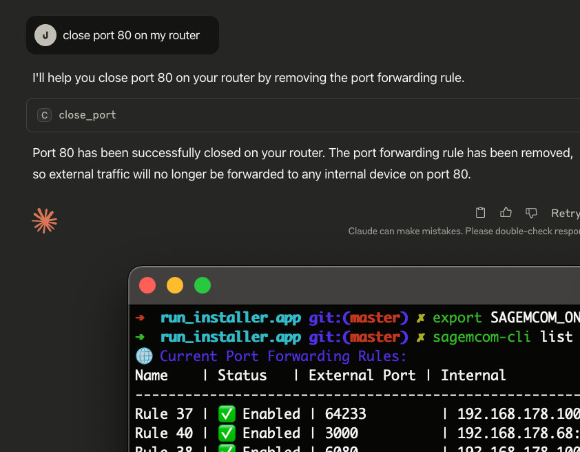

_Tested on MacOS w/ [Sagemcom F3896LG](https://www.ziggo.nl/klantenservice/apparaten/wifi-modems/smartwifi-modem-zwart) and only supports port management at this time_
# Sagemcom Configuration MCP Server & CLI


A command-line tool and MCP server to manage port forwarding on Sagemcom routers, specifically tested with Ziggo 
SmartWifi modem. This project provides both a direct command-line interface (`sagemcom-cli`) for managing port 
forwarding rules and an MCP server for integration with tools like Claude Desktop.


## Table of Contents

- [Quick Start](#quick-start)
- [Features](#features)
- [Requirements](#requirements)
- [Installation](#installation)
- [Configuration](#configuration)
- [Usage](#usage)   
  - [Command-Line (`sagemcom-cli`)](#command-line-sagemcom-cli) 
  - [Claude Desktop Integration (`sagemcom-mcp-server`)](#claude-desktop-integration-sagemcom-mcp-server)
- [Development](#development)
- [Troubleshooting](#troubleshooting)
- [Contributing](#contributing)
- [License](#license)

## Quick Start

Get up and running in under 2 minutes:

1. **Install UV** (if not already installed):
   ```sh
   curl -LsSf https://astral.sh/uv/install.sh | sh
   ```

2. **Download the latest release** from the releases page and extract it:
   ```sh
   tar -xvf sagemcom-mcp-server-0.1.0.tar.gz
   cd sagemcom-mcp-server-0.1.0
   ```

3. **Run the installer**:
   ```sh
   # For CLI tools only
   ./install-cli-dist.sh
   
   # OR for Claude Desktop integration
   ./install-mcp-dist.sh
   ```

4. **Set your router password**:
   ```sh
   export SAGEMCOM_MODEM_PASSWORD="your_router_password"
   ```

5. **Start using it**:
   ```sh
   # List current port forwards
   sagemcom-cli list
   
   # Open a port (example: forward external port 8080 to internal 192.168.178.100:80)
   sagemcom-cli open --name "Web Server" --local-address 100 --local-port 80 --external-port 8080
   ```

That's it! For more configuration options and Claude Desktop integration, see the detailed sections below.

## Features

- **MCP Server:** Integrates with Claude Desktop for AI-driven router management.
- **Command-Line Interface (CLI):** A powerful `sagemcom-cli` tool to open, close, and list port forwarding rules.
- **Secure:** Retrieves your router password securely from environment variables or the 1Password CLI.
- **User-Friendly:** Includes an interactive installation script for easy setup on macOS.
- **Flexible:** Supports both full IP addresses and shorthand (e.g., `100` for `192.168.178.100`).

## Requirements

- **Operating System:** macOS (due to the use of `open` and specific paths in the installer).
- **Python Environment:** `uv` is required for installation. You can install it with:
  ```sh
  curl -LsSf https://astral.sh/uv/install.sh | sh
  ```

## Installation

1.  **Build the Distribution Package:**
    Run the build script to create a distributable package.
    ```sh
    ./build-dist.sh
    ```
    This will create a file like `dist/sagemcom-mcp-server-0.1.0.tar.gz`.

2.  **Distribute and Install:**
    Copy the generated `.tar.gz` file to the target machine, extract it, and run the installer.
    ```sh
    # On the target machine
    tar -xvf sagemcom-mcp-server-0.1.0.tar.gz
    cd sagemcom-mcp-server-0.1.0
    # For MCP Server and Claude Desktop integration:
    ./install-mcp-dist.sh
    # For command-line tools (sagemcom-cli) only:
    ./install-cli-dist.sh
    ```
    The interactive installers will guide you through the necessary steps. `install-dist.sh` is primarily for setting up the MCP server for Claude Desktop, while `install-cli-dist.sh` is tailored for CLI usage.

## Configuration

The tools can be configured via environment variables:

- `SAGEMCOM_MODEM_IP`: The IP address of your Sagemcom router. Defaults to `192.168.178.1`.
- `SAGEMCOM_MODEM_PASSWORD`: Your router's password.
- `SAGEMCOM_ONEPASSWORD_ITEM`: The name of the item in 1Password that holds your router password. If this is set, the tool will use `op` to fetch the password. Defaults to `Ziggo SmartWifi Router`.

The `install-dist.sh` script helps configure these for the Claude Desktop environment. For command-line use, you can set them in your shell's profile (e.g., `.zshrc` or `.bash_profile`).

## Usage

### Command-Line (`sagemcom-cli`)

The `sagemcom-cli` provides a direct way to manage your router.

**List all port forwarding rules:**
```sh
sagemcom-cli list
```
Example output (format is illustrative):
```
Name          Protocol  External Port  Internal IP      Internal Port  Enabled
------------  --------  -------------  ---------------  -------------  ---------
MyWebServer   TCP/UDP   8080           192.168.178.100  80             True
SSH           TCP       2222           192.168.178.101  22             True
```

**Open a new port forwarding rule:**
```sh
sagemcom-cli open --name "My Web Server" --local-address 101 --local-port 80 --external-port 8080
```
This command opens port `8080` on your router and forwards traffic to port `80` on the local machine with IP shorthand `101` (e.g., `192.168.178.101`). The default protocol is `TCP/UDP`.

Parameters for `open`:
- `--name` (required): A descriptive name for the rule (e.g., "My Web Server").
- `--local-address` (required): The local IP address of the device to forward to (e.g., `192.168.178.101` or shorthand `101`).
- `--local-port` (required): The internal port on the local device (e.g., `80`).
- `--external-port` (required): The external port on the router (e.g., `8080`).
- `--protocol` (optional): The protocol. Can be `TCP`, `UDP`, or `TCP/UDP`. Defaults to `TCP/UDP`.

**Close an existing port forwarding rule (by external port):**
```sh
sagemcom-cli close --port 8080
```
Parameters for `close`:
- `--port` (required): The external port of the rule to close (e.g., `8080`).

**Open the router's web interface in your default browser:**
```sh
sagemcom-cli browser
```
This command attempts to open your router's admin page (e.g., `http://192.168.178.1`). It may also log out any active API session with the router.

### Claude Desktop Integration (`sagemcom-mcp-server`)

The `sagemcom-mcp-server` is automatically configured by the `install-dist.sh` script if Claude Desktop is detected. Once installed and Claude Desktop is restarted, you can use natural language commands within Claude Desktop to manage your router's port 
forwarding rules.

**Example Claude Desktop Prompts:**

- "Open port 8080 for my web server at 192.168.178.100 on local port 80 using sagemcom."
- "List all my current port forwarding rules using sagemcom."
- "Close the port forward on external port 8080 using sagemcom."
- "Open my router's web interface in a browser using sagemcom."

The MCP server handles these requests by interacting with your Sagemcom router.

